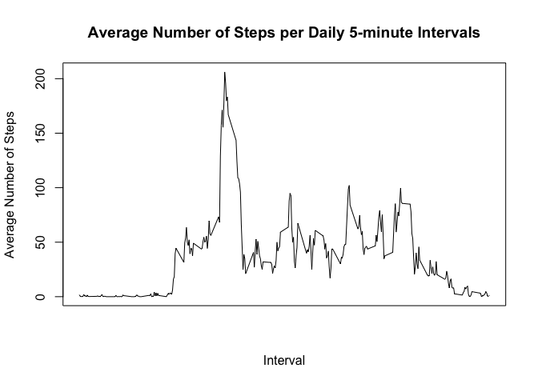

# Peer Assessment #1
GWM  

## Introduction

This assignment makes use of data from a personal activity monitoring device. This device collects data at 5 minute intervals through out the day. The data consists of two months of data from an anonymous individual collected during the months of October and November, 2012 and include the number of steps taken in 5 minute intervals each day.

## Data

The data for this assignment can be downloaded from the course web site:

Dataset: Activity monitoring data [52K] (https://d396qusza40orc.cloudfront.net/repdata%2Fdata%2Factivity.zip)

The variables included in this dataset are:

steps: Number of steps taking in a 5-minute interval (missing values are coded as NA)

date: The date on which the measurement was taken in YYYY-MM-DD format

interval: Identifier for the 5-minute interval in which measurement was taken

The dataset is stored in a comma-separated-value (CSV) file and there are a total of 17,568 observations in this dataset.

## Load and preprocess the data


```r
## Prepare for file download

if (!file.exists("data")) {
  dir.create("data")
}

fileUrl <- "https://d396qusza40orc.cloudfront.net/repdata%2Fdata%2Factivity.zip"

## download zip file
download.file(fileUrl, destfile = "~/data/activity_monitoring_data.zip", method = "curl")

## extract zipped txt file

unzip("./data/activity_monitoring_data.zip", exdir = "~/data")

## Review files

list.files("~/data")
```

```
## [1] "activity_monitoring_data.zip" "activity.csv"
```

```r
## Read in csv file

activity_monitoring <- read.csv("~/data/activity.csv",
                                colClasses = c("numeric", "character", "numeric"))

## convert the Date variable's values from character to Date

activity_monitoring[, 2] <- as.Date(activity_monitoring[, 2], "%Y-%m-%d")
```
## What is mean total number of steps taken per day?

1. Calculate the total number of steps taken per day


```r
library(dplyr)
```

```
## 
## Attaching package: 'dplyr'
## 
## The following objects are masked from 'package:stats':
## 
##     filter, lag
## 
## The following objects are masked from 'package:base':
## 
##     intersect, setdiff, setequal, union
```

```r
actvty_mntr_df <- tbl_df(activity_monitoring)

# Calculate the total number of steps taken per day

tot_steps_day <- actvty_mntr_df %>%
  group_by(date) %>%
  summarize(tot_steps_day = sum(steps, na.rm = TRUE))
```

2. Make a histogram of the total number of steps taken each day.


```r
## set up for single plot (1 x 1)

par(mfrow = c(1, 1))

## histogram of Total Number of Steps per Day

hist(tot_steps_day$tot_steps_day,
     breaks = 10,
     main = "Total Number of Steps per Day",
     xlab = "Date",
     ylab = "Steps per Day",
     col = "red")
```

 

3. Calculate and report the mean and median of the total number of steps taken per day.


```r
mean_median_steps_day <- tot_steps_day %>%
  summarize(mean_total_steps_day = mean(tot_steps_day, na.rm = TRUE),
            median_total_steps_day = median(tot_steps_day, na.rm = TRUE))

mean_1 <- mean_median_steps_day$mean_total_steps_day
median_1 <- mean_median_steps_day$median_total_steps_day
```

The mean of the total number of steps taken per day is **9,354.22951** steps per day.
The median of the total number of steps taken per day is **10,395.00** steps per day.

## What is the average daily activity pattern?


```r
avg_steps_ntrvl <- actvty_mntr_df %>%
  group_by(interval) %>%
  summarize(avg_steps_ntrvl = mean(steps, na.rm = TRUE))
```

1. Make a time series plot (i.e. type = "l") of the 5-minute interval (x-axis) and the average number of steps taken, averaged across all days (y-axis)


```r
with(avg_steps_ntrvl,
     plot(interval,
          avg_steps_ntrvl,
          type = "l",
          xaxt = "n",
          xlab = "Interval",
          ylab = "Average Number of Steps",
          main = "Average Number of Steps per Daily 5-minute Intervals"
          )
     )
```

 

```r
# axis.POSIXct(side = 1, elec_pwr_cnsmptn_ss$Time)
```

2. Which 5-minute interval, on average across all the days in the dataset, contains the maximum number of steps?


```r
max_ntrvl <- avg_steps_ntrvl[which.max(avg_steps_ntrvl$avg_steps_ntrvl), 1]$interval
```

The time interval that has the maximum average number of steps is **835**.

## Imputing missing values

Note that there are a number of days/intervals where there are missing values (coded as NA). The presence of missing days may introduce bias into some calculations or summaries of the data.

1. Calculate and report the total number of missing values in the dataset (i.e. the total number of rows with NAs)


```r
tot_missing <- sum(!complete.cases(actvty_mntr_df))
```

The total number of missing values in the data set is **2304**.

2. Devise a strategy for filling in all of the missing values in the dataset. The strategy does not need to be sophisticated. For example, you could use the mean/median for that day, or the mean for that 5-minute interval, etc.

---- Use the mean number of steps for a given 5-minute interval as the imputed value for the corresponding missing number of steps in same 5-minute interval.

3. Create a new dataset that is equal to the original dataset but with the missing data filled in.


```r
# Subset data frame into two data frames, one w/ missing step values and the other w/ non-missing
# step values.

actvty_mntr_df_ss1 <- actvty_mntr_df[which(is.na(actvty_mntr_df$steps)), ]
actvty_mntr_df_ss2 <- actvty_mntr_df[which(!is.na(actvty_mntr_df$steps)), ]

# Replace missing step values w/ imputed step values (see documentation above)

actvty_mntr_df_ss1a <- actvty_mntr_df_ss1 %>%
  select(date, interval) %>%
  right_join(avg_steps_ntrvl, by = "interval") %>%
  rename(steps = avg_steps_ntrvl)
  
actvty_mntr_df_ss1a <- actvty_mntr_df_ss1a[c("steps", "date", "interval")]

actvty_mntr_df_rvsd <- actvty_mntr_df_ss1a %>%
  bind_rows(actvty_mntr_df_ss2) %>%
  arrange(date, interval)
```

4. Make a histogram of the total number of steps taken each day and Calculate and report the mean and median total number of steps taken per day.


```r
tot_steps_day_2 <- actvty_mntr_df_rvsd %>%
  group_by(date) %>%
  summarize(tot_steps_day = sum(steps, na.rm = TRUE))

## set up for single plot (1 x 1)

par(mfrow = c(1, 1))

## histogram of Total Number of Steps per Day

hist(tot_steps_day_2$tot_steps_day,
     breaks = 10,
     main = "Total Number of Steps per Day (w/ imputed step values)",
     xlab = "Date",
     ylab = "Steps per Day",
     col = "blue")
```

 

```r
mean_median_steps_day_2 <- tot_steps_day_2 %>%
  summarize(mean_total_steps_day = mean(tot_steps_day, na.rm = TRUE),
            median_total_steps_day = median(tot_steps_day, na.rm = TRUE))

mean_2 <- mean_median_steps_day_2$mean_total_steps_day

median_2 <- mean_median_steps_day_2$median_total_steps_day
```

The new mean of the total number of steps taken per day is **10,766.1887** steps per day.
The new median of the total number of steps taken per day is **10,766.1887** steps per day.

--- Do these values differ from the estimates from the first part of the assignment?
---- Answer: Yes, the mean has increased and the median has decreased slightly.

--- What is the impact of imputing missing data on the estimates of the total daily number of steps?
---- Answer: Aligns the mean and median of the distribution of the total daily number of steps.

## Are there differences in activity patterns between weekdays and weekends?

For this part the weekdays() function may be of some help here. Use the dataset with the filled-in missing values for this part.

1. Create a new factor variable in the dataset with two levels – “weekday” and “weekend” indicating whether a given date is a weekday or weekend day.


```r
# Add "Weekday" factor variable to revised data set

actvty_mntr_df_rvsd <- actvty_mntr_df_rvsd %>%
  mutate(weekday = as.factor(ifelse(weekdays(date) %in% c("Saturday","Sunday"), "Weekend", "Weekday")))
```

2. Make a panel plot containing a time series plot (i.e. type = "l") of the 5-minute interval (x-axis) and the average number of steps taken, averaged across all weekday days or weekend days (y-axis).


```r
avg_steps_ntrvl_wkdy <- actvty_mntr_df_rvsd %>%
  group_by(interval, weekday) %>%
  summarize(avg_steps_ntrvl_wkdy = mean(steps, na.rm = TRUE))

# Multiple plots:
#
# top: Average Steps per 5-Minute Interval (Weekend)
# bottom: Average Steps per 5-Minute Interval (Weekday)

library(lattice)

xyplot(avg_steps_ntrvl_wkdy ~ interval | weekday,
       data = avg_steps_ntrvl_wkdy,
       type = "l",
       layout = c(1,2),
       main = "Average Number of Steps by 5-Minute Interval\nfor Day of Week = (Weekend, Weekday)",
       ylab = "Aveerage Number of Steps",
       xlab="5-Minute Interval"
       )
```

 

